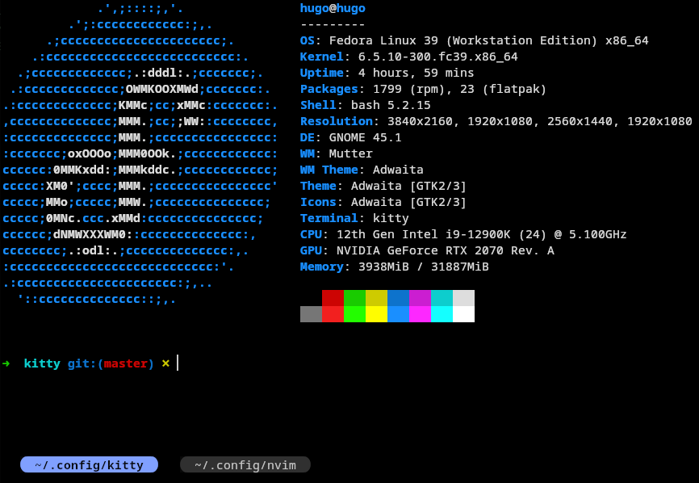

# kitty.conf

Kitty config for minimalistic users.

Key bindings are heavily inspired by [IntelliJ!](https://www.jetbrains.com/help/idea/mastering-keyboard-shortcuts.html)

## Shortcuts

### config

| key                                       | description   |
| ----------------------------------------- | ------------- |
| f5 | reload config |

### tab

| key                             | description        |
| ------------------------------- | ------------------ |
| <kbd>alt</kbd>+<kbd>←</kbd>     | goto previus tab   |
| <kbd>alt</kbd>+<kbd>→</kbd>     | goto next tab      |
| <kbd>alt</kbd>+<kbd>t</kbd>     | create new tab     |
| <kbd>alt</kbd>+<kbd>w</kbd>     | close window / tab |

### font

| key                          | description     |
| ---------------------------- | --------------- |
| <kbd>ctrl</kbd>+<kbd>+</kbd> | font size +     |
| <kbd>ctrl</kbd>+<kbd>-</kbd> | font size -     |
